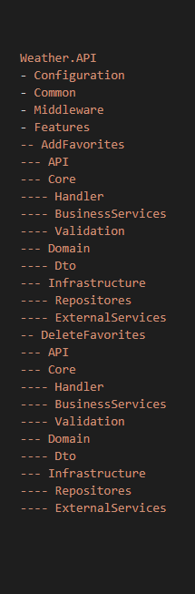
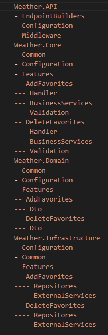

 # In Progress..
 

# Vertical Slice Architecture WeatherApi
[](https://github.com/Gramli/WeatherApi-VSA/actions/workflows/dotnet.yml)
[](https://app.codacy.com/gh/Gramli/WeatherApi-VSA/dashboard?utm_source=gh&utm_medium=referral&utm_content=&utm_campaign=Badge_grade)  

REST API solution demonstrates how to create API with Vertical Slice Architecture, minimal API and various of design patterns.  

Example API allows to get actual/forecast weather data by location from [Weatherbit](https://www.weatherbit.io/) throught [RapidAPI](https://rapidapi.com) and also allow's to add/delete favorite locations into [in memory database](https://learn.microsoft.com/en-us/ef/core/providers/in-memory/?tabs=dotnet-core-cli) and then get weather data by stored (favorites) locations.

## Menu
* [Get Started](#get-started)
* [Motivation](#motivation)
* [Architecture](#architecture)
* [Technologies](#technologies)

## Get Started
1. Register on [RapidAPI](https://rapidapi.com)
2. Subscribe [Weatherbit](https://rapidapi.com/weatherbit/api/weather) (its for free) and go to Endpoints tab
3. In API documentation copy (from Code Snippet) **X-RapidAPI-Key**, **X-RapidAPI-Host** and put them to appsettings.json file in WeatherAPI project
```json
  "Weatherbit": {
    "BaseUrl": "https://weatherbit-v1-mashape.p.rapidapi.com",
    "XRapidAPIKey": "value from code snippet",
    "XRapidAPIHost": "value from code snippet"
  }
```
4. Run Weather.API 

### Try it using .http file (VS2022)
 * Go to Tests/Debug folder and open **debug-tests.http** file (in VS2022)
 * Send request

## Motivation
Main motivation is to write practical example of simple API using Vertical Slice Architecture and then compare it to same API designed by Clean Architecture.

## Architecture
Project folows **[Vertical Slice Architecture](https://www.jimmybogard.com/vertical-slice-architecture/)** which instead of separation of technical concerns it encapsulating business logic of specific feature into vertical slice. So for example against [Clean Architecture](https://learn.microsoft.com/en-us/dotnet/architecture/modern-web-apps-azure/common-web-application-architectures#clean-architecture), one vertical slice is cross section of all layers like in picture below.


As this project is simple API, I decided to represent one vertical slice (or feature) as CRUD operation with some aditional business logic. Vertical slices should'nt reference each other so shared code is in Domain folder, for example WeatherService which is adapter to Weatherbit.Client project or DbContext is in Domain.
Every feature(slice) folder contains a similiar structure:
* request query or command - holds request parameters/data
* request handler - implementation of business logic
* specification holder - validation rules
* configuration - registering of classes into IoC container and minimal api endpoints.

Some slices also contains Dto objects, mapper profiles etc.., just all specific to feature(slice).

## Comparsion of Vertical Slice Architecture and Clean Architecture

### Pull Request of new CRUD endpoint
Clean Architecture - [Pull Request](https://github.com/Gramli/WeatherApi/pull/2)

Vertical Slice Architecture (VSA) - [Pull Request](https://github.com/Gramli/WeatherApi-VSA/pull/1)

Both [Clean Architecture Weather Api (CA)](https://github.com/Gramli/WeatherApi) and [Vertical Slice Architecture Weather Api (VSA)](https://github.com/Gramli/WeatherApi-VSA) are just small APIs, but there is clearly one big difference. CA has almost twice more touched files, which could result in bugs. Therefore, it is crucial for CA to follow SOLID principles and have good code coverage.
In VSA, I add files to my new feature folder, except when editing other features due to the return type (which is the same as in CA). However, as a project grow, code duplication can become a significant issue. In case we find out code duplication, one way to resolve this issue is by moving the code to the domain. However, this can cause the domain to become excessively large.

Based on the PR comparison, we can also see that VSA is well-suited for tiny or CRUD APIs due to its simplicity and minimal use of abstractions. When we adhere to the same folder structure, it can result in a clean and clear solution.
### Unit Testing
In CA, unit testing is easy thanks to the high level of abstractions. However, as the project grows, it can result in a lot of repetitive work. Fortunately, with the support of AI, this issue can be alleviated. In VSA, it depends. When we look at this example, everything is within the handler (business logic, access to the database). Therefore, for growing project, this is not a good approach because writing and maintaining unit tests can become increasingly difficult even for the AI. But for this simple example, it fits well.

### Conclusion
In comparison, VSA resolves the issue of CA by touching all layers for just one feature. However, on the other hand, there is a risk of code duplication which CA reduces by splitting the code into layers and then into reusable services. Unit testing is easier and cleaner in CA, but it results in repetition. Unit testing in VSA could be difficult in cases when we put too much logic into one file. The solution for these issues can be to create a hybrid of both architectures. The first approach is to use VSA in the base with a feature folder structure and follow the rule that features do not reference each other. From CA, use a good level of abstractions in features where needed; we don't have to create abstractions in simple CRUD operations. The second approach could be to use CA as the base architecture and create a 'Feature' folder in every layer. Then, put feature-related logic for each layer into its respective 'Feature' folder and of course follow the rule that features do not reference each other.

<table>
  <thead>
    <tr>
      <th width="500px">Vertical Slice Architecture Hybrid First Approach </th>
      <th width="500px">Clean Architecture Hybrid First Approach</th>
    </tr>
  </thead>
  <tbody>
  <tr>
   <td></td>
   <td></td>
</tr>
<tr>
 <td>Shared folders like Common and Configuration could become really big because they are shared between all features. But we have the power to create new features with a small or even without a structure, just with a few files. Also, we touch only the feature folder so we have a lower risk of creating bugs, but can still create some code duplications.</td>
 <td>The CA hybrid architecture structure is way bigger; it forces us to adhere to the structure so we lower the risk of code duplication, but we have to touch all layers even in the feature-related folder.</td>
</tr>
  </tbody>
</table>

Vertical Slice Architecture Hybrid First Approach           |  Clean Architecture Hybrid First Approach
:-----------------------------:|:-----------------------------:
|
Shared folders like Common and Configuration could become really big because they are shared between all features. But we have the power to create new features with a small or even without a structure, just with a few files. Also, we touch only the feature folder so we have a lower risk of creating bugs, but can still create some code duplications. | The CA hybrid architecture structure is way bigger; it forces us to adhere to the structure so we lower the risk of code duplication, but we have to touch all layers even in the feature-related folder.

Both hybrid approaches lower the risks and disadvantages but do not resolve them. So we still need to choose which architecture suits our project best.


As I have a lot of experience with CA in small and middle-sized projects, I am satisfied with CA first hybrid approach, but there must be emphasis on maintaining the structure. It means following SOLID principles and patterns like CQRS, Repository, Factory, etc. Then the project is well maintainable and testable. I am new to VSA, but I am enthusiastic about it. I will definitely use it in tiny projects.

## Technologies
* [ASP.NET Core 8](https://learn.microsoft.com/en-us/aspnet/core/introduction-to-aspnet-core?view=aspnetcore-8.0)
* [Entity Framework Core InMemory](https://learn.microsoft.com/en-us/ef/core/providers/in-memory/?tabs=dotnet-core-cli)
* [AutoMapper](https://github.com/AutoMapper/AutoMapper)
* [FluentResuls](https://github.com/altmann/FluentResults)
* [Validot](https://github.com/bartoszlenar/Validot)
* [GuardClauses](https://github.com/ardalis/GuardClauses)
* [Moq](https://github.com/moq/moq4)
* [Xunit](https://github.com/xunit/xunit)
