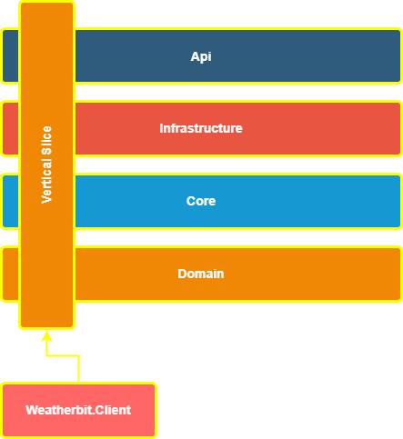

 # In Progress..
 

# Vertical Slice Architecture WeatherApi
[](https://github.com/Gramli/WeatherApi-VSA/actions/workflows/dotnet.yml)
[](https://app.codacy.com/gh/Gramli/WeatherApi-VSA/dashboard?utm_source=gh&utm_medium=referral&utm_content=&utm_campaign=Badge_grade)  

REST API solution demonstrates how to create API with Vertical Slice Architecture, minimal API and various of design patterns.  

Example API allows to get actual/forecast weather data by location from [Weatherbit](https://www.weatherbit.io/) throught [RapidAPI](https://rapidapi.com) and also allow's to add/delete favorite locations into [in memory database](https://learn.microsoft.com/en-us/ef/core/providers/in-memory/?tabs=dotnet-core-cli) and then get weather data by stored (favorites) locations.

## Menu
* [Get Started](#get-started)
* [Motivation](#motivation)
* [Architecture](#architecture)
* [Technologies](#technologies)

## Get Started
1. Register on [RapidAPI](https://rapidapi.com)
2. Subscribe [Weatherbit](https://rapidapi.com/weatherbit/api/weather) (its for free) and go to Endpoints tab
3. In API documentation copy (from Code Snippet) **X-RapidAPI-Key**, **X-RapidAPI-Host** and put them to appsettings.json file in WeatherAPI project
```json
  "Weatherbit": {
    "BaseUrl": "https://weatherbit-v1-mashape.p.rapidapi.com",
    "XRapidAPIKey": "value from code snippet",
    "XRapidAPIHost": "value from code snippet"
  }
```
4. Run Weather.API 

### Try it using .http file (VS2022)
 * Go to Tests/Debug folder and open **debug-tests.http** file (in VS2022)
 * Send request

## Motivation
Main motivation is to write practical example of simple API using Vertical Slice Architecture and then compare it to same API designed by Clean Architecture.

## Architecture
Project folows **[Vertical Slice Architecture](https://www.jimmybogard.com/vertical-slice-architecture/)** which instead of separation of technical concerns it encapsulating business logic of specific feature into vertical slice. So for example against [Clean Architecture](https://learn.microsoft.com/en-us/dotnet/architecture/modern-web-apps-azure/common-web-application-architectures#clean-architecture), one vertical slice is cross section of all layers like in picture below.



As this project is simple API, I decided to represent one vertical slice (or feature) as CRUD operation with some aditional business logic. Vertical slices should'nt reference each other so shared code is in Domain folder, for example WeatherService which is adapter to Weatherbit.Client project or DbContext is in Domain.
Every feature(slice) folder contains a similiar structure:
* request query or command - holds request parameters/data
* request handler - implementation of business logic
* specification holder - validation rules
* configuration - registering of classes into IoC container and minimal api endpoints.

Some slices also contains Dto objects, mapper profiles etc.., just all specific to feature(slice).

## Comparsion of Vertical Slice Architecture and Clean Architecture

### Pull Request of new CRUD endpoint
In Progress..

Clean Architecture (CA) - [Pull Request](https://github.com/Gramli/WeatherApi/pull/2)
Vertical Slice Architecture (VSA) - [Pull Request](https://github.com/Gramli/WeatherApi-VSA/pull/1)

Both are just small APIs, but there is clearly one big difference. CA has many more touched files, which could result in bugs in large projects. Therefore, it is crucial for CA to follow SOLID principles and have good code coverage.

In VSA, I simply add files to my new feature folder (except when editing other features because of the return type, which is the same as in CA). In large-scale projects, there can be a problem with code duplication, which is also a crucial issue. This can be resolved by moving the code to the domain, but then the domain can become really big.

From this example, we can also see that VSA is a great fit for small or CRUD APIs because of its simplicity and lack of many abstractions. When we follow the same folder structure, it can become a nice and clear solution.
### Unit Testing
In Progress..
### Conclusion
In Progress..
## Technologies
* [ASP.NET Core 8](https://learn.microsoft.com/en-us/aspnet/core/introduction-to-aspnet-core?view=aspnetcore-8.0)
* [Entity Framework Core InMemory](https://learn.microsoft.com/en-us/ef/core/providers/in-memory/?tabs=dotnet-core-cli)
* [AutoMapper](https://github.com/AutoMapper/AutoMapper)
* [FluentResuls](https://github.com/altmann/FluentResults)
* [Validot](https://github.com/bartoszlenar/Validot)
* [GuardClauses](https://github.com/ardalis/GuardClauses)
* [Moq](https://github.com/moq/moq4)
* [Xunit](https://github.com/xunit/xunit)
